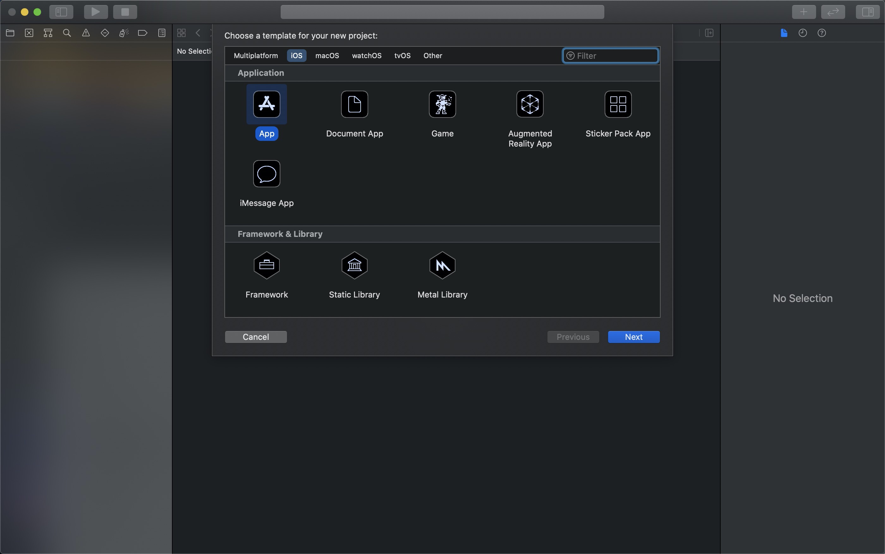
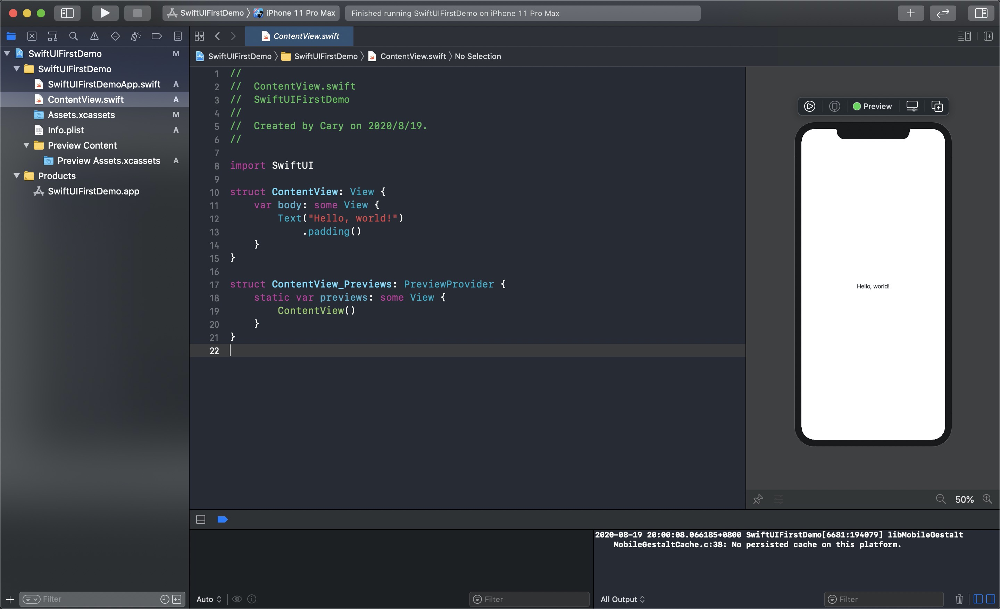

# Hello World

本章教程教将带你创建第一个 `SwiftUI` 项目。

## 开发环境

* Xcode 12 Beta 5

## 创建新项目

打开 `Xcode`，选择菜单 `File` -> `New` -> `Project...`。

选择 `App` 类型，接下来设置好项目名称（示例名称为 `SwiftUIFirstDemo`）。

按上述步骤即可成功创建第一个 `SwiftUI` 项目。

## 项目结构

TODO

## 示例代码

可参考：[SwiftUIFirstDemo](https://github.com/CaryZheng/SwiftUI-Tutorial/tree/master/code/SwiftUIFirstDemo)