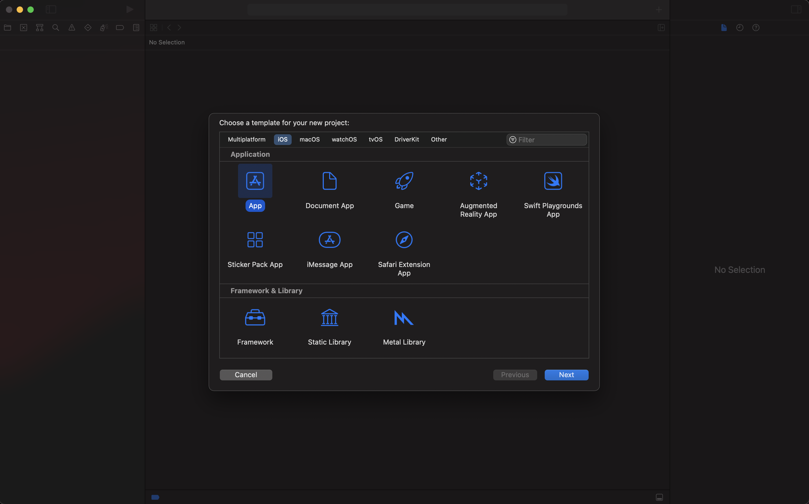
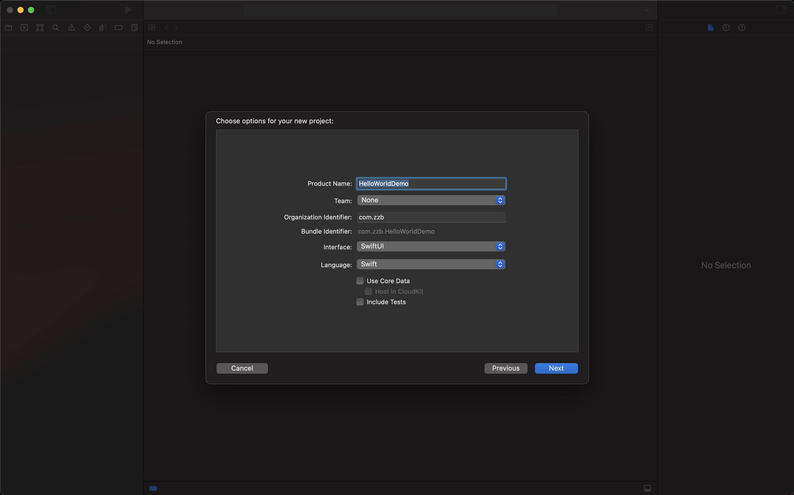
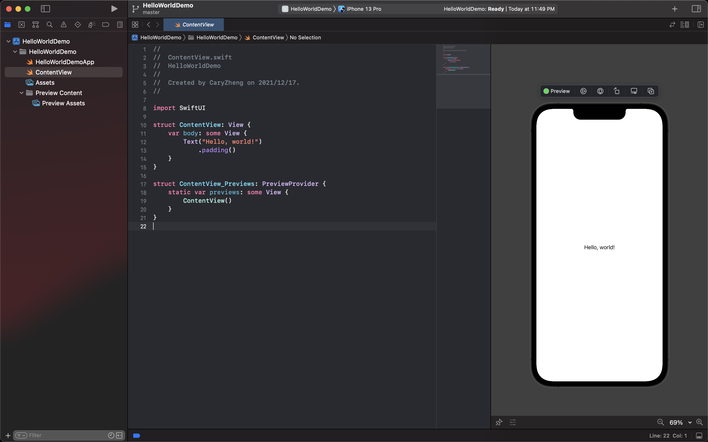
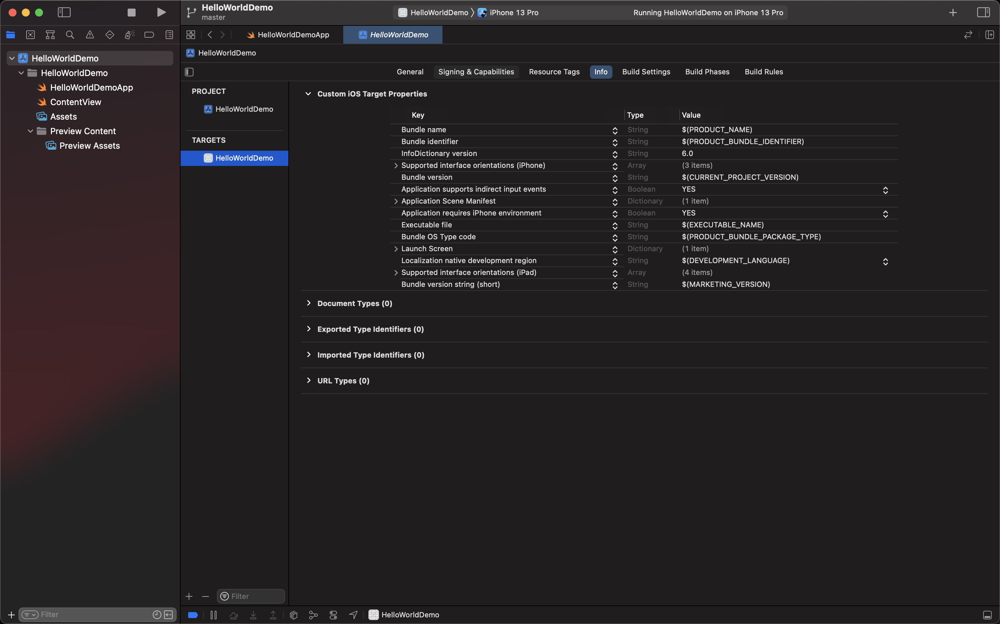

# Hello World

本章教程教将带你创建第一个 `SwiftUI` 项目。

## 开发环境

* Xcode 13.2
* Swift 5.5.2

## 创建新项目

打开 `Xcode`，选择菜单 `File` -> `New` -> `Project...`。



选择 `App` 类型，接下来设置好项目名称（示例名称为 `HelloWorldDemo`）。



按上述步骤即可成功创建第一个 `SwiftUI` 项目。



## 项目结构

```shell
.
├── HelloWorldDemo
│   ├── HelloWorldDemoApp.swift
│   ├── ContentView.swift
│   └── Assets.xcassets
└── Preview Content
    └── Preview Assets.xcassets
```

### HelloWorldDemoApp.swift

```swift
import SwiftUI

@main
struct HelloWorldDemoApp: App {
    var body: some Scene {
        WindowGroup {
            ContentView()
        }
    }
}
```

#### @main

使用 `@main` 注解的 `class` 或 `struct` 将作为应用程序的主入口。

#### App

`App` 协议中定义了 `main()` 方法，可配合 `@main` 注解使用。

#### Scene

`body` 遵循 `Scene` 协议，每个 `Scene` 包含 view 层级中的 root view，并且生命周期由系统来控制。

### ContentView.swift

#### 实现

```swift
import SwiftUI

struct ContentView: View {
    var body: some View {
        Text("Hello, world!")
            .padding()
    }
}
```

`ContentView` 实现了 `View` 协议，并放置了一个 `Text` 控件，运行此示例代码将在界面上输出一串文本 `Hello, world!` 。


#### 预览

```swift
struct ContentView_Previews: PreviewProvider {
    static var previews: some View {
        ContentView()
    }
}
```

`ContentView_Previews` 用于预览使用，可在不运行完整程序的情况下查看当前 `View` 的实际效果，便于调试。

### info.plist

如今在左侧的工程目录中不直接显示 `info.plist` 文件了，目前已迁移到 `Targets -> info` 中了。



## 示例代码

可参考：[HelloWorldDemo](https://github.com/CaryZheng/SwiftUI-Tutorial/tree/master/code/HelloWorldDemo)